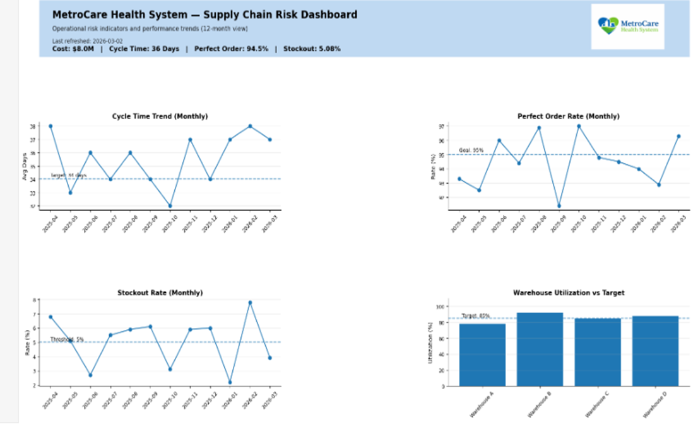

# Healthcare Supply Chain Risk Analytics

## Overview

Healthcare systems face significant operational risk from medication supply disruptions. These disruptions can directly impact patient safety, operational continuity, and financial stability.

This project analyzes medication supply disruption risk within a healthcare system environment and proposes a structured mitigation strategy using data-driven decision frameworks.

The analysis was developed as part of the graduate course:

ADTA 5830 – Risk Management and Value Creation for Analytics  
University of North Texas – MS in Advanced Data Analytics

## Project Highlights

• Identified medication supply disruption as the highest operational risk for the healthcare system  
• Developed a weighted risk scoring framework to prioritize operational risks  
• Designed a mitigation strategy focused on inventory visibility and forecasting alerts  
• Defined operational KPIs for supply chain performance monitoring  
• Built an executive dashboard concept for ongoing risk monitoring

## Business Context

Healthcare supply chains are increasingly vulnerable to medication shortages due to supplier disruptions, demand volatility, and limited inventory visibility.

Operational leaders require analytics-driven frameworks to identify, prioritize, and mitigate supply chain risks before they impact patient care.

This project demonstrates how structured risk analytics can support proactive supply chain decision-making within healthcare systems.
---

## Problem Statement

Medication supply instability is a high-impact operational risk for healthcare systems. Limited inventory visibility, reactive procurement practices, and forecasting gaps can increase the likelihood of stockouts and emergency purchasing.

This project evaluates these risks and proposes an analytics-informed strategy to improve supply chain resilience.

---

## Analytical Approach

The analysis includes:

• Structured risk prioritization  
• Operational constraint evaluation  
• Inventory visibility improvement strategy  
• Forecast variance monitoring  
• Threshold-based alerting framework  
• KPI design for supply chain performance monitoring  

The goal is to connect **analytics insights directly to operational decision-making**.

## Risk Prioritization Framework

The project uses a weighted risk scoring model to prioritize operational risks based on patient safety impact, financial exposure, operational disruption, likelihood of occurrence, and reputational risk.

---

## Mitigation Strategy

Two primary initiatives were proposed:

### 1. Inventory Visibility and Standardization

Improving system-wide visibility into medication inventory levels across facilities enables earlier detection of potential shortages and improves coordination across procurement teams.

### 2. Demand Forecasting and Alerting

Implementing structured demand forecasting monitoring and threshold alerts allows supply chain teams to proactively address potential supply disruptions before they impact operations.

---

## Key Performance Indicators

The proposed analytics framework includes monitoring the following operational KPIs:

• Medication stockout rate  
• Forecast variance  
• Inventory fill rate  
• Emergency procurement frequency  
• Procurement cycle time  

These metrics support continuous monitoring and proactive decision-making.

---

## Value Creation

The proposed framework supports measurable operational improvements including:

• Reduced medication stockouts  
• Improved forecasting accuracy  
• Lower emergency procurement costs  
• Increased operational resilience  

The objective is to transform analytics insights into **practical supply chain decision support tools**.

## Operational Impact Model

The mitigation strategy connects analytics insights directly to operational outcomes within the healthcare supply chain.

Improved inventory visibility and forecasting monitoring enable earlier detection of potential supply disruptions. When inventory levels fall below defined thresholds, alerts trigger procurement review before shortages occur.

Operational improvements supported by this framework include:

• Earlier identification of medication shortages  
• Reduced emergency procurement events  
• Improved coordination across procurement teams  
• Increased medication availability for patient care  

By linking risk monitoring to operational actions, analytics becomes a practical decision-support tool for healthcare supply chain leaders.

## Implementation Approach

The proposed strategy is designed to work within existing healthcare supply chain systems rather than requiring major technology replacement.

Implementation would involve three primary phases.

### Phase 1: Data Visibility

Establish consistent reporting of medication inventory levels across facilities and integrate these reports into centralized monitoring dashboards.

### Phase 2: Risk Monitoring

Apply the weighted risk scoring framework to identify high-risk medications based on supply stability, usage rates, and supplier reliability.

### Phase 3: Decision Support

Deploy threshold-based alerts and KPI reporting that enable procurement teams to respond proactively to emerging supply disruptions.

This approach ensures analytics insights are translated into practical operational actions that improve supply chain resilience.

## Repository Purpose

This repository demonstrates how analytics frameworks can be applied to operational risk management within healthcare supply chains.

The project focuses on translating data insights into actionable decision-support tools that improve supply chain resilience and operational stability.

## Executive Supply Chain Risk Dashboard

To support operational risk monitoring, supply chain leadership can track key performance indicators through a centralized analytics dashboard.

The dashboard provides visibility into operational performance trends including cycle time, order accuracy, stockout rates, and warehouse utilization.

Monitoring these indicators allows leadership teams to detect supply chain instability early and respond before disruptions impact patient care.

Example executive dashboard used to monitor operational supply chain risk indicators across the healthcare system.
---

## Project Artifacts

Executive Report  
docs/Executive_Report.pdf

Presentation Deck  
docs/Presentation_Deck.pptx

Recorded Presentation  
media/Presentation_Video_Link.md

---

## Skills Demonstrated

Healthcare Supply Chain Analytics  
Risk Management Framework Design  
Operational KPI Development  
Forecasting and Inventory Strategy  
Executive-Level Communication  

---

## Author

Geoffrey P. Threats
MBA - ERP, MS - MIS
MS – Advanced Data Analytics  
Supply Chain Operations & Analytics Professional
